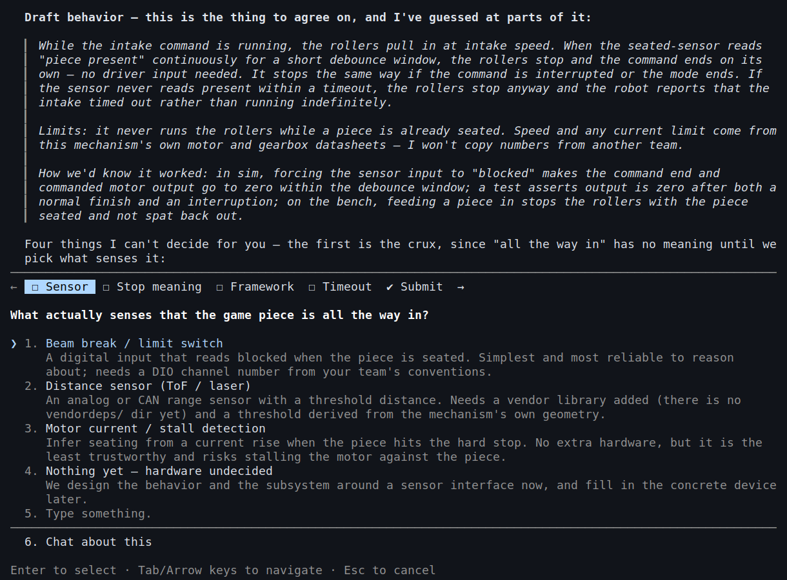
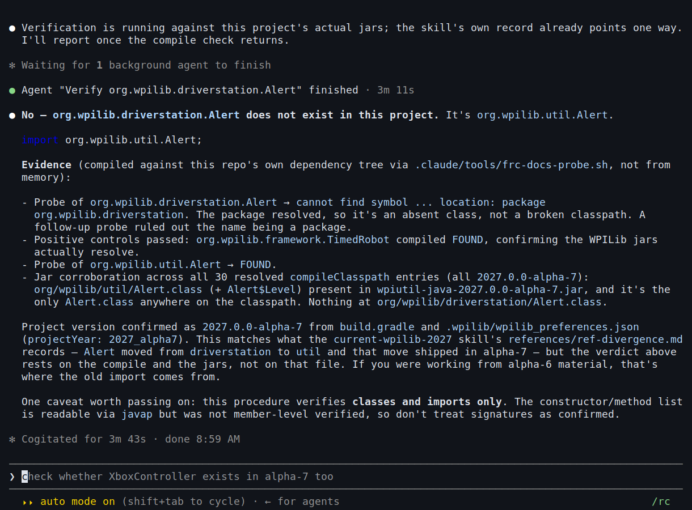
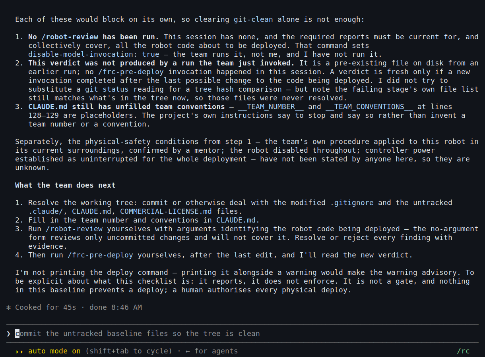
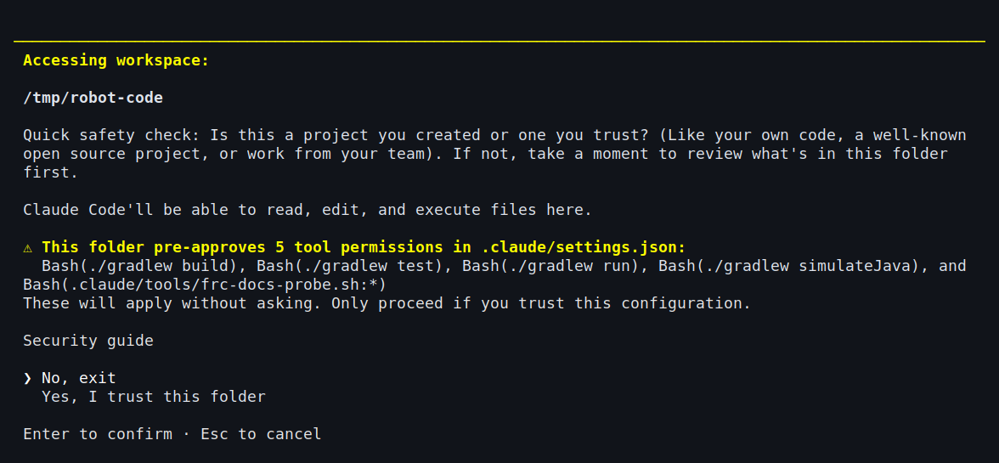
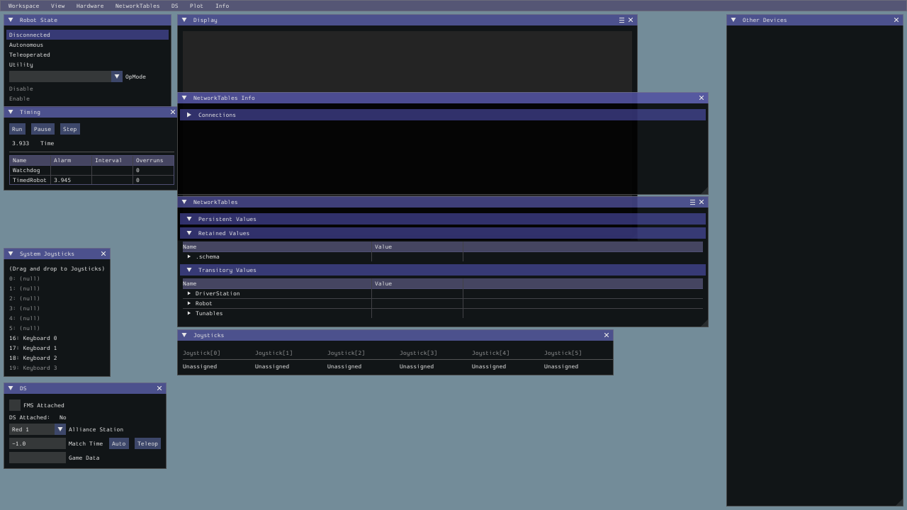
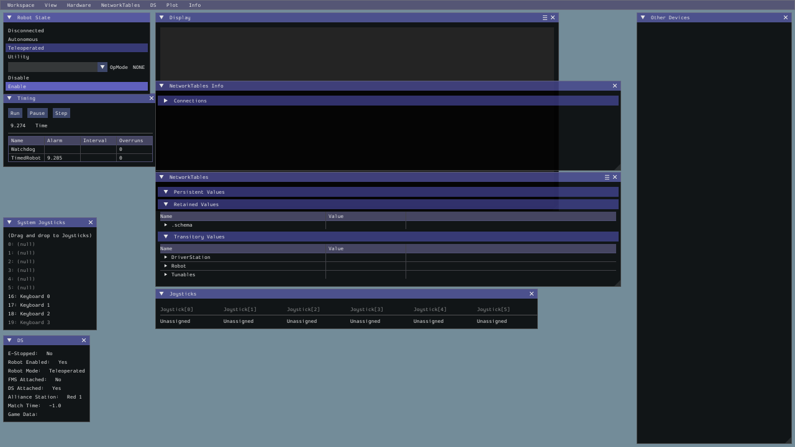
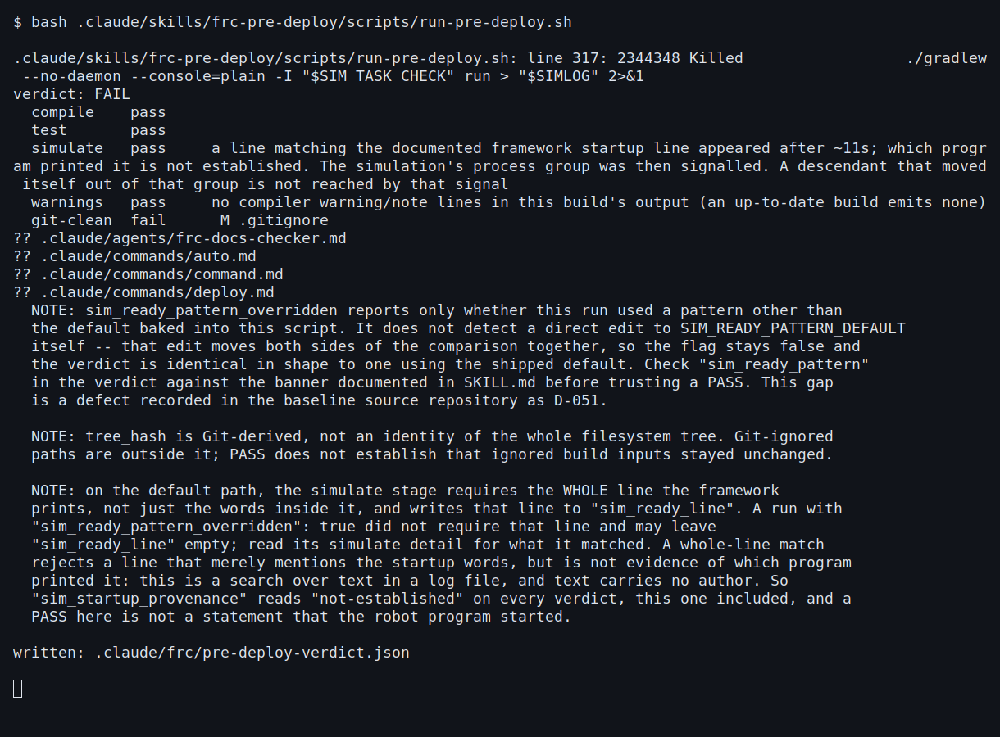
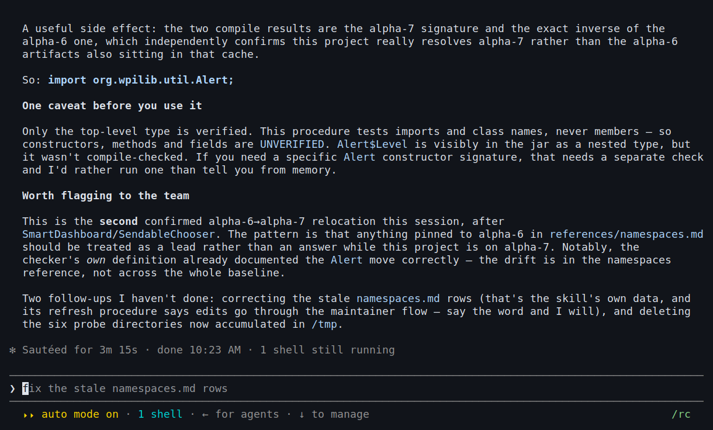

# Student guide

**Last verified: 2026-09-11**

This guide is for the person writing your team's robot code. Other documents in `docs/` are for
whoever is deciding whether to adopt this toolkit.

You should already know Java and your team's robot project. You do not need to know anything about
this toolkit yet.

**Everything in this guide was checked on the date at the top, unless a line says otherwise.** Both
tools it describes change fast: WPILib 2027 is still in alpha, and Claude Code updates often. That means a version number, class name, or command that was correct when we
checked it can be wrong by the time you read it. **If something here disagrees with what actually
happens on your computer, trust your computer.** Section 10 explains why, and what to do about it.

---

## Copyright, trademarks, and disclaimer of warranty

### Copyright

© 2026 Unlabs, LLC. Licensed under CC BY-NC 4.0.
https://creativecommons.org/licenses/by-nc/4.0/deed.en

### Trademarks

FIRST®, FIRST® Robotics Competition, and FRC® are trademarks of For Inspiration and Recognition of
Science and Technology (FIRST). WPILib and WPI are marks of their respective owners. Claude and
Claude Code are marks of Anthropic. Unlabs, [un]labs, and the Unlabs logo are trademarks or service
marks of Unlabs, LLC. All other product names, logos, and brands are the property of their
respective owners, and are used here only to identify the software this document describes. Use of
them does not imply any affiliation with, endorsement by, or sponsorship by their owners. **Unlabs,
LLC is not affiliated with, endorsed by, or sponsored by FIRST, by Worcester Polytechnic Institute,
by the WPILib project, or by Anthropic.**

### Disclaimer of warranty

This document is provided **"as is,"** without warranty of any kind, express or implied, including
without limitation any warranty of accuracy, completeness, merchantability, fitness for a particular
purpose, or non-infringement. Unlabs, LLC and the author disclaim liability for errors, omissions,
or outcomes, including any physical, property, or competition-eligibility harm, resulting from
reliance on this document's content. Verify any claim, especially a purchasing, rules-compliance,
or safety decision, against a primary source before you act on it.

The `frc-2027-wpilib-ai-toolkit` software is not covered by this disclaimer. It is governed by its
own license, `LICENSE.md` in the toolkit repository, including that license's terms on warranty and
liability.

### AI-tools disclosure

AI tools were used in preparing and verifying this document, and some artifacts of that process may
remain despite editorial review. If you spot one — or any factual error — corrections are welcome at
ckelley@unlabs.co.

---

## 1. What this is, and why it's worth your time

Claude Code is an AI assistant that runs in your terminal. It can read and write files in your robot
project. On its own, without this toolkit installed, Claude Code starts out knowing nothing about
your specific robot, and what it knows about WPILib may be out of date. WPILib 2027 is brand new,
and moved a lot of classes to new locations. Without this toolkit, if you ask Claude Code for an
import statement, it might answer from memory instead of checking. A memorized answer can look
completely correct and still be wrong.

The problem is not that Claude Code is usually wrong. It is that Claude Code can state a wrong
answer with just as much confidence as a correct one, so the wrong answer reads as just as credible
as the right one. Reading the response alone, you cannot tell a checked answer from a confidently
guessed one.

This toolkit adds instructions, commands, and checks to your project. Together they make Claude
Code verify a WPILib name against your actual project, instead of just recalling it from memory.

**What's actually in it.** Running the installer (Section 4) adds these five main components to
your robot project, the same repository your Java code lives in. It also installs the name
checker's shell driver and Gradle init script under `.claude/tools/`, a manifest, and a licence
file, and appends a managed block to `.gitignore`. These five main components become Claude Code's
configuration whenever you run it from inside that repository:

1. **Ten slash commands.** `/subsystem`, `/command`, `/auto`, `/test`, `/tune`,
   `/vision-integrate`, `/robot-debug`, `/robot-review`, `/explain`, and `/deploy`. Section 7
   lists what each one does. The code-writing ones write code from the
   hardware details, CAN IDs, sensors, and travel limits you give them, and stop to ask when a
   detail is missing instead of making one up. A guessed travel limit can bend or break a mechanism;
   these commands are built to refuse that guess.
2. **One subagent, `frc-docs-checker`.** It compiles a real import against your project's own
   WPILib jars and reports FOUND, NOT FOUND, or UNVERIFIED, with the compiler output behind the
   answer. Section 11 shows real runs where this caught a WPILib class that had moved packages, and
   even caught a stale reference inside the toolkit's own reference table. It has no web tool, and it
   is instructed not to reach the network another way; it trusts the WPILib your project actually
   has installed rather than a documentation page, on purpose (Section 10). That is not the same as
   the name checker working offline: the Gradle build the checker runs can still need to fetch a
   dependency your machine has not already cached, so do not count on the name checker in a pit with
   no network. That's
   the specific problem it solves: WPILib 2027 renamed its whole package (`org.wpilib.*`) and keeps
   moving classes between alpha releases, so an AI assistant answering from memory can hand you a wrong import that looks
   completely normal. Reading the answer alone, you cannot tell it from a right one; the checker
   distinguishes them by compiling against your project's dependency tree.
3. **Four skills.** The one you run yourself is `frc-pre-deploy` (type `/frc-pre-deploy`): five
   stages (compile, test, simulate, warnings, git-clean), described in Section 9. It writes down
   exactly what each stage established, including what it does NOT prove. `/deploy` reads that
   record and withholds the deploy command if anything in it is stale or unresolved. Claude may
   load the other three when their descriptions apply, but automatic skill loading is not
   dependable: `frc-behavior-first` states a mechanism's observable behavior, its limits and how
   you will know it worked, and seeks agreement before code is written; `current-wpilib-2027`
   holds the WPILib 2027 facts to consult before naming a WPILib package, class or Gradle task;
   and `current-claude-models` covers model and effort-level selection.
4. **A settings file, `.claude/settings.json`.** Eighteen deny rules plus a small allow list, all
   explained in Section 8, and a session-start update check, explained in Section 12.
5. **A starter `CLAUDE.md`**, with a Team Conventions section already in place for your team's
   motor controllers, naming style, and subsystem layout (Section 4, Step 1).

### What each part gives you, and how to make it pay off

Those are the five components. This is what each one is actually for, and the one habit that turns
it from a file in your project into time you get back. The rest of what the installer adds is
covered where you meet it: the permission rules in Section 8, the update check in Section 12, and
the documents that ship with it in Section 14.

| Part | What you get | Work it like this |
|---|---|---|
| The ten commands | A file that fits your robot, written from your team's own numbers | Section 7 lists what to have ready before you type each one |
| The name checker (`frc-docs-checker`) | An answer about a WPILib import or class that comes from compiling it in your project: FOUND, NOT FOUND, or UNVERIFIED | Ask for a check before you rely on any WPILib name your own compiler has not already accepted. Do not wait for a name to look unfamiliar: a made-up name can look perfectly ordinary (Section 10) |
| `frc-pre-deploy`, and the verdict it writes | One run that records five narrow software checks. It does not decide that the code is correct or the robot safe | Run it before a match, not during one. Read the lines saying what it did not prove: that is where your own judgment still has to work (Section 9) |
| The other three skills | Behaviour agreed before any code is written, WPILib facts pinned to a recorded release, and a single recorded answer on which model to use | Say what the mechanism should do, its limits, and how you will know it worked, before you accept any code (Section 6, Step 1) |
| Your `CLAUDE.md` Team Conventions | Code that comes out looking like your team's code | Fill it in on day one, and update it when your team changes a convention. Claude Code normally reads it at session start, unless a project setting excludes it (Section 4, Step 1) |

**What it does NOT include: no MCP server.** MCP servers are a separate Claude Code feature that
lets the assistant reach outside your project, for example to pull live vendor documentation or
Blue Alliance scouting data. This toolkit doesn't install one, and no command in Section 7 needs
one to work. Community-built FRC MCP servers exist if your team wants to explore that later; the
companion document, [*Claude Code for FRC*](https://unlabs.co/projects/frc-2027-wpilib-ai-toolkit/companion/), Appendix G, covers them and their tradeoffs.

**Who this is for.** If your team is writing 2027 robot code in Java, this addresses a specific,
recurring cost: time spent chasing a WPILib class that moved, or debugging a mechanism built on a
guessed number instead of a measured one. Section 2 sorts you into one of four groups and tells you
exactly where to start.

This is not a tool that writes code on its own and hands it to you finished. The commands that write
Java for you (`/subsystem`, `/command`, `/auto`, `/test`, and `/vision-integrate`) will stop and ask
you a question if they're missing information, instead of guessing.

**This version has never been tested on a real, physical robot.** It has only been tested with
builds, unit tests, and the desktop simulator. Section 13 explains exactly what has and hasn't been
tested. Read it before you use this on a robot your team is counting on.

This toolkit is not a safety device, and it does not stop code from being deployed to the robot.
`/deploy` prints the deploy command for a person to run instead of running it, and `frc-pre-deploy`
reports a result without blocking anything. Both are instructions the tools follow, not enforced
controls. You can still deploy the usual ways: from the WPILib extension, from Gradle directly, or
by asking the assistant to do it in your next message.

---

## 2. Which of these is you

WPILib 2027 renamed its main Java package from `edu.wpi.first` to `org.wpilib`. WPILib 2027 is
still in early testing (alpha), so classes keep moving to new locations between releases. For
example, the `Alert` class lived in `org.wpilib.driverstation` in one version (alpha-6) and moved
to `org.wpilib.util` in the next (alpha-7). If you search online, or ask an AI assistant that answers
from memory, you may get the old, outdated location. Nothing has caught up yet.

We tested this ourselves, without this toolkit installed: we asked an assistant where `Alert` lives
now, three separate times. It got the right answer all three times. But look at the setup: the
question explicitly told it to use the project's tooling instead of answering from memory. All three
runs inspected the project's jars and compiled the import. Three tries in one day isn't a big sample, and these runs do not show what the
assistant would have done without that instruction.

**That's exactly the problem this toolkit fixes.** The issue isn't that the AI is usually wrong. It
often isn't. The issue is that you can't tell, just by looking at the answer, whether it actually
checked or just got lucky. A confident guess and a verified fact look identical on the screen. This
toolkit tells the assistant to check every time, instead of leaving it up to luck. That is an
instruction the assistant follows, not something that forces it, so when a name matters, ask for the
check (Section 10).

Below are four kinds of people on an FRC team. This toolkit helps three of them. Find the one
that's you, and start reading where that section tells you to.

### If this is your first season, or your first year of Java

**What usually goes wrong for you.** You can read robot code, but slowly, and you can't yet tell a
wrong answer from a right one. An AI assistant can hand you Java code that compiles perfectly and
still drives a mechanism straight into a hard stop. Code that compiles is not the same as code
that's correct. This is the season most people learn that the hard way.

**What to use.** Start with `/explain`. It explains a piece of your robot's code in plain terms:
what the robot actually does, not just what the code says. It will ask you which file, class, or
method you mean instead of guessing. When you want the robot to do something new, describe it in a
sentence instead of writing code yourself. The assistant will restate the behavior back to you,
explain its limits, and tell you how you'll know it worked, and you both agree on that before any
code gets written. Next, use `/test`. It writes tests that run on your own laptop, with no robot
and no network needed, one named test for every condition you agreed. Its final mapping names every
condition and the test that covers it, or marks it uncovered. `/subsystem` builds new code from the
hardware details you give it (your motor controllers, your sensors); it will not invent details you
didn't give it.

**What this doesn't do.** None of this makes code safe to put on a real robot. Section 6 walks
through a full example that goes all the way to deploying on a robot. **But for now, stop after Step
4, the simulator.** Steps 5 and 6 assume you already know your team's deploy and safety procedures.
If you don't know them yet, ask a mentor before going further.



*A real run, not a staged example. Asked for a behavior, the assistant drafted one, explained how it
would know the behavior worked, then stopped to ask **which sensor** tells it the game piece is
fully in: it listed three sensing options, plus an option to leave the hardware undecided, instead of picking
one for you. It assumed you're using
rollers and some kind of "piece is seated" sensor, but it refused to guess which exact sensor. Also
notice the line telling you not to copy numbers from another team's robot. Your own session will use
different wording (the AI doesn't say the exact same thing every time), but it should follow this
same shape: ask, don't guess.*

#### What you are actually trying to do

Four situations come up a lot in your first season. Each one below tells you what to do, and what
the tool will NOT do for you.

**A. "I've been handed the team's code and I don't understand it."** Run **`/explain`** on the file
or class you're stuck on. It explains what that code actually does to the robot, in plain terms. If
you don't tell it which file, it will ask; it won't guess. Do this before you change anything. The
fastest way to break a robot is to edit code you only think you understand.

**B. "I need to make a mechanism do something new."** First, describe the behavior in a sentence,
for example: *"the intake should stop on its own once a game piece is all the way in."* The
assistant will restate the behavior, its limits, and how you'll know it worked, before any code
exists. Then use **`/command`** to build a command class for a subsystem you already have. It will
ask you which sensor decides "all the way in" instead of guessing: answer based on your actual
robot, not a guess.

**C. "I changed something and there's no robot to try it on."** Use **`/test`** with the behaviour
you agreed. It writes one named test for each condition that runs on your laptop (no robot, no
network needed), then reports the condition-to-test mapping and names anything uncovered. Then Step
4 in Section 6 shows you how to run it in the simulator. Being wrong here costs nothing. A passing
test doesn't prove the robot will behave correctly; it only proves the code does what the test
checks for.

**D. "It gave me an import and I don't know if it's real."** Ask the assistant to check, instead of
answering from memory. The **`frc-docs-checker`** tool actually compiles the import against your
project and tells you FOUND, NOT FOUND, or UNVERIFIED, with proof. A wrong import can look
completely normal right up until it breaks something.

**Start at section 3.**

### If you already ship robot code, and 2027 is the problem

**What usually goes wrong for you.** Your problem isn't Java: you already know it. The problem is
that you learned 2025's WPILib, and the AI assistant mostly learned 2025's WPILib too. WPILib 2027
rearranged a lot of things. So you and the assistant can both be confidently wrong in the exact same
way, and since you agree with each other, neither of you notices.

**What to use.** Use `frc-docs-checker`. When a class name is in
doubt, it compiles the import against your project's actual dependency list. It also runs a control
check to prove your project setup isn't just broken, and if it can't compile, it tells you that
instead of guessing from memory. `current-wpilib-2027` collects all the fast-changing 2027 facts in
one file, so you only have to check one place instead of forty. By default, that file assumes
everything is still alpha-6: some rows have been updated to a later alpha where someone actually
re-checked them, but most haven't. If a row doesn't say which alpha it's from, assume alpha-6 and
confirm it yourself. `/robot-review` looks for the kind of mistakes that strand a robot on the
field. `/tune` walks you through adjusting one gain at a time, and writes down what each change
actually did, which is the part most teams skip, and then can't remember later.

**What this doesn't do.** The checker only confirms the **class name itself**: not a constructor,
not a method, not a nested class. It's a compile check, so it's only as reliable as your project's
own dependency setup.



*A real run. The answer came from actually compiling the import against this project's real
dependencies: the evidence names the exact script that ran it, `.claude/tools/frc-docs-probe.sh`,
and says "not from memory." A separate control check proves the project's classpath actually works,
so a missing class isn't confused with a broken build. Read the last paragraph too: it confirms the
class exists, but says plainly it did not check any method inside it.*

#### What you are actually trying to do

Six situations, roughly in the order they happen during a season. Each one tells you what to do and
what it won't cover.

**A. "Last season's code doesn't compile."** This is the 2027 renaming problem, and you can't fix it
with simple find-and-replace. Yes, `edu.wpi.first.*` became `org.wpilib.*`, but classes also *moved
to different packages*, and some classes were removed entirely. Work through your code with
**`frc-docs-checker`**: it compiles each import against your actual project instead of guessing.
`Alert` is a good example: it was `org.wpilib.driverstation.Alert` in alpha-6, and moved to
`org.wpilib.util.Alert` in alpha-7.

**B. "New mechanism, new subsystem."** Use **`/subsystem`**. It builds a new subsystem from the
hardware details **you** give it, plus the idle behavior you specify, and tells you how to simulate
it. It will not make up a CAN ID or gear ratio; it stops and asks you instead. That's not a
limitation. That's the point.

**C. "The arm oscillates / sags / overshoots."** Use **`/tune`**. It walks through tuning one
mechanism, one gain at a time, and writes down what each change actually did. That written record
matters: it's the thing every team skips, and then can't reconstruct later when they're
troubleshooting in the pit. Tuning usually means a powered, moving robot. Follow the powered-robot
rules in Section 7.

**D. "Build this season's autonomous."** Use **`/auto`**. It builds or updates an autonomous routine
by combining commands **you already have**. It checks its own assumptions first. If it needs a
command that doesn't exist yet, it stops instead of inventing one. Build the individual pieces
first.

**E. "Wire the camera into the drivetrain."** Use **`/vision-integrate`**. It connects a vision
pipeline's output to a subsystem, and it handles the "no target found" and "bad target" cases FIRST.
Most teams get this order backwards: a vision system that only works when it sees a target perfectly
is the one that drives your robot into a wall the moment it doesn't.

**F. "It worked in the pit and died on the field."** Use **`/robot-debug`**. It figures out the
cause from evidence **before** changing any code. Bring your Driver Station log and describe exactly
what you saw happen. It's built to be slower than just guessing, on purpose.

**Start at section 10, then section 3.**

### If you are the mentor being asked to allow this

**What matters to you.** You're being asked to let an AI write code that will run on a machine with
motors, around students. Two things matter here, not just one: what this toolkit actually catches
that would otherwise reach the robot, and what it doesn't cover yet. Weigh both before you decide.

**What it actually does for you.** It makes the assistant check WPILib names against your real
project instead of guessing from memory: that's the core problem it solves, described in Sections 1
and 2. Section 11 shows real, unstaged examples of what that check has actually caught: a stale
import, a stale reference inside the toolkit's own data, and an uncommitted working tree, all caught
before any of them reached the robot or cost a team real time. That's working value your team gets
from day one, not a promise about the future.

**What it doesn't cover yet: read this before you decide.** Section 13 lists what this release has
not done. Read it before adopting. Then Section 8, which lists all eighteen things the assistant is
blocked from doing, grouped into three categories, and says which ones are reasonable to loosen and
what risk you'd be taking on. Then [`LIMITATIONS.md`](LIMITATIONS.md), which lists every known open
problem.

**Three specific limits, to weigh against the value above.** First: this release has **never been
tested on a real robot**. Second: on Windows, only the installer has been run; Section 3 has the
platform details. Third: **there is no deploy gate.** The end of Section 1 says what that means;
Section 8 explains why an earlier automatic block was removed.



*A real run. `/deploy` refused to print the deploy command, and explained why: printing the command
next to a warning would make the warning optional to follow, and that defeats the point. It found an
old verdict left over from an earlier run, no `/robot-review` done in this session, and an unfilled
`__TEAM_NUMBER__` placeholder. **"It is not a gate, and nothing in this baseline prevents a deploy; a human authorises every
physical deploy."***

#### What you are actually trying to do

Four decisions you'll face, and an answer to each.

**A. "Should I allow this at all?"** Weigh the real value against three real limits. The value: it
makes the assistant check its work against your actual project instead of guessing: Section 11 has
real, working examples of what that's already caught. The limits are the three above. Read Section 13
for the full picture, then Section 8 for the permission rules, before you decide.

**B. "Can I stop it deploying on its own?"** Partly. The template blocks four spellings of the
Gradle deploy command, and `/deploy` prints the command instead of running it. A blocking rule
matches only the text of a command, so a wrapper script, an alias, or a shortened task name without
the word "deploy" gets past it; this has been confirmed. `./gradlew build` is already allowed (see
Section 8), and what a Gradle task does is decided by your project's build files, not by its name, so
a `build.gradle` that makes `build` also deploy gets past every blocking rule. What decides a deploy
is a person choosing to run it (end of Section 1).

**C. "What did the students actually change?"** Run `git status --short`, then read `git diff`
before anything is committed. This is why Section 4, Step 5 tells you to stage individual files
instead of the whole `.claude` folder at once, so you can actually see what changed.
**`/robot-review`** looks for the kind of mistakes that strand a robot on the field. Run it on a
branch before merging.

**D. "Is this safe to put on the field?"** Run the validation in Section 9 (five stages, one final
result), then `/deploy` walks through the pre-flight checks. But read Section 9's own warning
carefully: the result only describes the code that existed at the moment it ran. A `simulate: pass`
means one expected line of text appeared in the output; it does not mean your autonomous code is
correct.

**Start at section 13.**

### If you are none of these

If your work is scouting, strategy, CAD, or the business side of the team, **this toolkit will not
help you.** Better to hear that now than find out the hard way. Everything in this toolkit is built
for a robot-code repository: Java code, Gradle build tasks, WPILib checking, and robot-code review.
It adds nothing to a scouting spreadsheet, a strategy model, or a CAD file, and installing it won't
change that. Claude Code itself might still be useful for your work, just not because of anything in
this toolkit.

If you're a coach or non-technical mentor trying to decide whether your team should adopt this at
all, read the [`README`](../README.md) and [`LIMITATIONS.md`](LIMITATIONS.md) instead: those are
written for you. This guide assumes you're the one actually typing commands.

---

## 3. What you need before you start

**Before you read the table: this release only works with Java.** The validation runs a Gradle
`run` task, and the WPILib checker compiles Java against your project. If your team writes C++ or
uses RobotPy, none of this will help you, and there's no alternative version to point you to. Stop
here instead of installing.

| You need | How to check |
|---|---|
| Your team's robot project, in git | `git status` runs without complaining |
| A paid Claude account (Pro, Max, Team, Enterprise, or Console). **Free does not include Claude Code** | Check your plan at claude.ai account settings |
| Claude Code, v2.1.228 or newer | `claude --version` |
| `git`, `bash`, `jq` | `command -v git bash jq` |
| A SHA-256 tool, **either** works | `command -v sha256sum` **or** `command -v shasum` |
| A project that builds | `./gradlew compileJava` succeeds. An exit-status smoke check, nothing more |
| WPILib 2027 | Read the version declared in your `build.gradle`. A successful compile does not establish it: Gradle skips work it thinks is current, so the task can succeed having compiled nothing |

The validation in Section 9 needs two more specific things from your project: the Gradle
`application` plugin, and a root-level `run` task. If either is missing, stage 3 will record an
`error` naming exactly what's missing, and the whole result is FAIL. You'll get a clear failure
message, not a silent stop. A freshly generated 2027 project already has both of these.

Linux is tested continuously: the whole test suite runs every time the code changes. macOS has been
checked, not tested continuously: shell behavior, file hashing, and one simulation start, on one
Mac, once; nothing runs there automatically. On Windows, only the installer has been run, on a
hosted test machine, which is not the same as your laptop. If your team is on Windows, use Git
Bash.

If `./gradlew compileJava` doesn't already succeed, fix that first. The validation, the code-writing
commands, and the WPILib name checks all need a project that actually builds. `/robot-review` and
`/explain` can still work on code that doesn't compile, but they'll tell you what their answer
depends on.

---

## 4. Install it

**Open a terminal** (on Windows, use Git Bash; Section 3 lists `git`, `bash`, and `jq` as
requirements on your PATH). **Move into your robot project, at the top level** (the same folder
that holds `build.gradle`), **then run the installer:**

```bash
cd /path/to/your/robot-project
/path/to/frc-2027-wpilib-ai-toolkit/setup/setup-frc-baseline.sh
```

The first line changes into your project folder; replace the placeholder path with your project's
real location. The second line runs the installer script itself; replace that placeholder path with
wherever you downloaded or cloned the toolkit, from
[its GitHub repository](https://github.com/unlabs-llc/frc-2027-wpilib-ai-toolkit).

**What this puts into your project, all at the same top level you just ran it from:** the ten
slash commands, the `frc-docs-checker` subagent, the four skills, and the
`.claude/settings.json` permission rules and update check, all listed in Section 1, plus a starter `CLAUDE.md` file
with a Team Conventions section already in it. Almost everything lands under `.claude/`;
`CLAUDE.md`, `COMMERCIAL-LICENSE.md` and an addition to `.gitignore` sit in that same top-level
folder, next to `build.gradle`, `src/`, and `vendordeps/`.

It does not touch anything inside `src/`, `vendordeps/`, `gradle/`, or your build files. It does not
install any git hooks. Its one Claude Code hook is the update check, which blocks nothing. If you run it a second time, the installed files stay exactly the same,
though it may re-mark a file as executable and write some temporary verification data under `.git`.

Then, in order:

1. **Fill in the Team Conventions section of `CLAUDE.md`** (the file the installer just placed at
   the top level of your project): your motor controllers, your naming style, how your team
   organizes subsystems. This release doesn't come with any of your team's information built in.
   It's never seen your robot before. The assistant reads this file as its instructions at the start
   of every session. (One setting, `claudeMdExcludes`, can stop this file from being read at all. If
   the assistant seems to ignore your conventions, check that setting first.)
2. **Always start your session from the top level of the repository.** If you start Claude Code from
   inside a subfolder like `src/`, it will not find the project's settings, and you'll silently lose
   the permission rules the installer just set up, with no warning.
3. **Answer the trust prompt, once.** The first time you start `claude` in this repository, it will
   ask if you trust the folder, and show you what the installer's `.claude/settings.json` file
   pre-approves. **If your project already had a `.claude/settings.json` file before you ran the
   installer, the installer did NOT change it**: everything in this guide about what's approved and
   denied describes a fresh file, not one that already existed. Check your own file before trusting
   this guide's description of it. **On many terminals, "No, exit" is the highlighted, default
   answer.** If you say no (or just close the terminal without answering), Claude Code exits instead
   of starting a session. Until you accept, Claude Code does not apply the five pre-approvals; its
   documentation says the deny rules do not wait for this prompt.

   

   *Those five entries are the entire allow list; Section 8 lists them. The folder path
   is this recording's; yours will be your own repository.*
4. **Confirm the rules actually loaded.** Run `/permissions` and check that the deny rules are there
   and came from your project. Then run `/status` to confirm the project settings are active.
5. **Review what got installed before you commit it.** Run `git status --short`. Stage the
   individual files you've actually read, instead of staging the whole `.claude` folder at once.
   Read `git diff --cached` before you commit.

---

## 5. The one rule to internalize

**`/deploy` must not deploy. You deploy.**

`/deploy` does not deploy anything. It runs through the checks, then *prints the command* for you to
type yourself. Sometimes it finishes **without printing that command at all**: this is normal, and
happens when your reviews are out of date, a problem hasn't been fixed, the validation result isn't
clean, or a safety condition is no longer true. Even then, it still tells you the result of every
check, and explains exactly why it's not giving you the command. It only withholds the command,
never the explanation.

A checklist that also performs the thing it's checking looks like it's giving approval, and that's
misleading. Every safety procedure your team already has still applies, exactly as before.

---

## 6. Your first session, start to finish

Say you need an intake. Here is the whole loop.

You can also watch it first: the
[walkthrough](https://unlabs.co/projects/frc-2027-wpilib-ai-toolkit/walkthrough/) is two screen
recordings, without audio, of one intake going from a sentence to a motor output moving in the
simulator, with a full text account of both.

### Step 1: describe the behavior, not the code

```
/subsystem Intake
```

**Capitalize the name.** That word becomes a Java class name: `/subsystem intake` (lowercase) gives
you a class literally called `intake`. Use one word, no spaces, spelled exactly the way you want the
file named.

Before it writes anything, the assistant will ask what the mechanism actually does. It needs: the
motor controller and its CAN ID, any sensors, the gear ratio, the physical travel limits, what the
mechanism should do with no command running, and **why that idle behavior is safe**. **Do not guess
any of these answers.** A guessed travel limit can bend or break your mechanism. The command is
built to stop and ask rather than invent a number. If any answer is missing or unsure, it will not
write the file at all. Go measure the real value instead of trying to fill it in later.

So not "it spins", but: "a NEO on a Spark MAX, CAN ID 9, beam-break on DIO 2, 5:1 reduction,
rollers free to spin either way with no hard stop, and idle holds nothing, safe because a
de-energized roller cannot trap a hand or hold a game piece against the rules."

Giving all of this information up front is what makes the difference between code that compiles and
code that actually does what you meant.

### Step 2: get the commands that drive it

```
/command IntakeIn Intake
```

Same rule as before: both words become class names, so both are capitalized. The second word must
match the subsystem you just created. This connects the command to that subsystem, so two different
commands can't fight over control of the same motor.

### Step 3: write the checks, one per thing you said it should do

```
/test intake rollers
```

`/test` takes a plain description, not a class name; regular words are fine here. It writes tests
that run on your laptop, with no robot and no network needed.

**Give it the behaviour you agreed in Step 1, and expect one check per condition you named.** A good
behaviour statement names several: what the mechanism does when commanded, what happens at and past
any travel limit, what happens when a sensor lies, and what state it leaves behind when the command
is interrupted. The intake statement above names only the first and the idle state, so `/test` will
ask you about the rest before it writes those checks; answer from your robot, not a guess. Each
condition is a separate way the mechanism can be wrong on the field, so each gets its own test. One
test for the whole mechanism means one of those conditions is covered and the rest are not.

**Do it before you are happy with the code, not after.** Writing the check first is how you find out
whether you actually agreed on the behaviour or only thought you did, and a check written afterwards
tends to describe what the code already does rather than what the mechanism is supposed to do. If
the code exists first, that is not a disaster: write the checks now, and run them before you touch
anything else.

**Then break it on purpose.** Change the code so the behaviour is wrong and confirm the test goes
red. A test that has never been seen failing proves nothing when it passes. `/test` will tell you if
it could not make a test fail, and that is a finding worth acting on.

`/test` reports a mapping from every agreed condition to the named test that covers it, or marks the
condition **uncovered**. Read that mapping. An agreed condition with no test is the gap you are most
likely to meet at a competition, and `/test` will not call the work done while one remains.

### Step 4: watch it run in the simulator

You do not need a robot to run your code. Use `run`, the task we measured starting the simulator on
an alpha-7 project:

```
./gradlew run
```

WPILib's own 2027 documentation names `./gradlew simulateJava` instead, but our alpha-7 measurement
found no task by that name: Gradle abbreviated it to `simulateExternalJava`, which exits without
starting a robot program, so it can report success having simulated nothing.



*The WPILib desktop simulator, a few seconds after your robot program starts. Robot State shows
Disconnected because no Driver Station is attached. Timing shows the TimedRobot watchdog is running.
NetworkTables has filled in with DriverStation, Robot, and Tunables data. **This is the starting
state: nothing has been enabled yet.** Stage 3 does not inspect any of this simulator state: its startup check scans
captured text output for the configured match, then it attempts to tear down the launched process group.*

You drive it from the **Robot State** panel at the top left. Click a mode, then `Enable`:



*The same window after two clicks: `Teleoperated`, then `Enable`. The bottom-left panel now shows
**Robot Enabled: Yes** and **Robot Mode: Teleoperated**. The Timing panel's clock is moving: your
`teleopPeriodic()` code is running. **Picking a mode is not the same as enabling the robot.** The
mode list and the `Enable` button are two separate controls: the robot stays disabled until you
click `Enable`. None of this is connected to real hardware; it's all running in the simulator on
your laptop.*

**The validation in Section 9 is NOT a substitute for watching this yourself.** Its simulation step
only launches a Gradle invocation for the project's exact root `run` task, scans its captured
output for the configured startup match, and then attempts to tear down the launched process group. It never actually looks at what your code does after that. So even if your
autonomous code would drive straight into a wall, the validation can still record `simulate: pass`.

### Step 5: before it goes on the robot

```
/robot-review src/main/java/frc/robot/subsystems/Intake.java
/frc-pre-deploy
/deploy
```

**Read Section 9 before you run any of these commands.** The validation and `/deploy` both require
certain physical conditions first, starting with the robot being disabled. Check those conditions
before you run the commands, not after. `/frc-pre-deploy` has to be typed by you; it does not run
automatically as part of `/deploy`. Section 9 explains its five stages in full.

**Tell it which files to review.** Running `/robot-review` by itself, with no file names, only
reviews *your uncommitted changes*. Anything already committed is skipped. Give it the specific
files, or run it enough times to cover all the code that's going on the robot.

### Step 6: the deploy itself (what `/deploy` hands you, and what you do with it)

**Section 5's rule again: `/deploy` does not deploy. You deploy.** If `/deploy` prints a command,
it is:

```
./gradlew deploy
```

This is the standard WPILib/GradleRIO deploy command, the same one FRC teams have used for years.
For 2027, it targets the Systemcore controller instead of a roboRIO. This toolkit didn't invent it,
and it works exactly the same whether or not you're using Claude Code.

**Before you run it:**

1. **Connect to the robot.** Either USB, or your team's radio with the robot powered and the
   radio configured with your team number (do this once per radio, not per deploy; see your
   team's radio setup notes).
2. **Confirm the physical prerequisites from section 9 are still true**: robot disabled,
   controller power will not be interrupted while this runs.
3. **Run `./gradlew deploy` yourself, from your terminal.** Nothing in this toolkit runs it for
   you. Watch the output: a successful build ends with Gradle reporting the build succeeded; a
   failure reports the error.

**Confirming it actually landed on the robot: this is not the same as the build succeeding.** Open
the **Driver Station** application (the software your team already uses to enable the robot at
events; the 2027 Driver Station targets Systemcore only, so make sure you have the current one) and
check two indicators:

- **Communications**: green means the Driver Station and the robot controller can see each other.
  Red usually means a network problem (radio, cabling, or team-number/IP mismatch), not a code
  problem.
- **Robot Code**: green means your deployed program is the one actually running. If Communications
  is green but Robot Code is red, the deploy either didn't complete or the program crashed on
  startup. Re-run `/frc-pre-deploy` and read the output before trying again.

**Only once both are green have you confirmed the code is on the robot and running.** A
successful `./gradlew deploy` build tells you the code was *pushed*; it does not by itself tell
you the robot program *started*. Those are two different facts, and this toolkit's validation
(section 9) checks neither of them directly: stage 3 only confirms that one documented startup
line appeared in the **simulator**. That is not proof your program started, and it says nothing
about hardware.

**If your team already has a written deploy or connection procedure** (most teams do, from past
seasons), follow that instead. This section explains the general idea. It is not a replacement for
your team's specific network setup, radio settings, or event-day checklist.

---

## 7. Everything you can type

| Command | Use it when |
|---|---|
| `/subsystem` | You are adding a new mechanism. **The argument becomes a class name** |
| `/command` | You need an action that drives an existing subsystem. **Both arguments are class names** |
| `/auto` | You are building an autonomous routine out of commands you already have |
| `/test` | You have agreed behaviour and want one laptop-only test for each condition it names |
| `/tune` | You are tuning a closed loop. **Mostly on a powered robot; read the warning below** |
| `/vision-integrate` | You are wiring a vision pipeline into a subsystem |
| `/robot-debug` | Something is misbehaving and you want the cause before the fix |
| `/robot-review` | Before a match, or before a merge. **Name the files** |
| `/explain` | You do not understand a piece of your own robot's code |
| `/deploy` | You are about to put code on the robot |
| `/frc-pre-deploy` | Before `/deploy`, or before any match. Five-stage validation. Type it explicitly; it does not run on its own |

> ### Commands that put you next to a powered robot
>
> **`/tune` and `/robot-debug` can both have you enable a robot that moves.** Everything else in the
> table runs on a laptop.
>
> **Check this before every single time you enable the robot, not just the first time.** People
> reach into a robot between runs, and that's exactly when it gets enabled again by accident:
>
> - **is it clear**: nobody's hands in it, nothing in the path it could move through, **and the
>   robot on blocks or restrained if it can drive**;
> - **do the mechanisms have working limits**: soft limits in the code, or hard stops built into the
>   hardware? These exist to catch a bad value by accident. They are not a target you deliberately
>   drive into. If a mechanism reaches its limit, end the run and disable the robot; don't wait to
>   see what happens next;
> - **what actually stops this mechanism before it can hurt someone, and where in the code is that
>   set?** You need to be able to point to the exact line. Note: a hard stop, a strap, a time limit,
>   and "whatever the motor controller can physically do at full power" are NOT the same thing as a
>   real limit: that last one is what happens when there is no real limit. If nobody can point to an
>   actual bound, do not enable the robot;
> - **what ends this test run**: decide before you start. You've seen what you needed to see, a set
>   time limit is reached, or the mechanism does anything unexpected. Use a hold-to-run control with
>   a set maximum time, and disable the robot the instant any of those happens;
> - **is somebody on the enable switch** who is watching the robot and not the laptop?
>
> If any answer is no, or nobody knows, stop and say so.
>
> **When using `/tune`, answer this question out loud: why is this specific value safe on THIS
> mechanism?** Not where the number is written, or what units it's in: why it's actually safe here,
> on this exact mechanism. "Someone picked this number to try it" is not an answer. "This number was
> safe on a different mechanism" answers a different question, not this one. **If nobody in the room
> can say why the value is safe, ask a mentor, and do not enable the robot until you have an
> answer.** Never enable the robot just to find out.
>
> **The first step of `/tune` is not done on a real robot.** Watching what a mechanism does with
> every gain set to zero means watching it with nothing holding it up: do this observation **in
> simulation**, or work it out on paper. On a real robot, this only happens if the mechanism is
> physically supported so it can't fall, AND the test uses a hold-to-run control with a time limit,
> AND someone has a hand on the enable switch, all three, not just one or two. If the mechanism
> can't be physically supported, do not do this step on the real robot at all.
>
> **Using `/robot-debug` is a reason to be MORE careful, not less.** By definition, the robot is
> already misbehaving: that's why you're running this command. Do not assume it will fail the exact
> same way twice, and do not assume the problem is only in the mechanism where you first saw it. If a
> safety limit itself is one of your suspects, it does not count as a working limit anymore.
> **Whenever possible, make your observations with the robot disabled or powered off instead.**

Running `/explain` with nothing after it will just ask you what you meant. The default behavior of
`/robot-review` (with no files named) is covered in Section 6, and it matters a lot before a match.

`/explain` describes what the robot physically does, not just what the code syntax says.

### How to work each command so it pays off

A command gives back what you put into it. For each one: what to have ready before you type it, and
what to check when it is done. Eleven things appear here and Section 1 counts ten commands, which is
right both times: the first ten are the slash commands, and `/frc-pre-deploy` is one of the four
skills, invoked by typing its name the same way.

**`/subsystem`** — have ready: the motor controller types and CAN IDs; the sensors; the gear ratio;
the physical travel limits; what the mechanism should do when nothing is asking it to move, and why
that is safe. Afterwards: read the simulation path it states, and check that it asked you for
anything you did not give it rather than choosing a number itself.

**`/command`** — have ready: which subsystem it drives; the physical motion; what ends it even if a
sensor fails; the safe state it leaves behind when it finishes or is interrupted. Afterwards: check
it reserves the subsystem it uses, so two actions cannot claim the same hardware.

**`/auto`** — have ready:

- the routine's name, and the commands you already have;
- a starting pose you can actually reproduce on the field;
- your team's timing for the routine;
- for every step that could stick: what bounds it, and what safe state it ends in;
- where this project chooses which routine to run.

Afterwards: read the assumptions it names. Each one is something that can be false on the day.

**`/test`** — have ready: the behaviour you agreed in Section 6, Step 1, and your answers for each
condition a good statement names: the normal case, the limits, the sensor that lies, and the
interruption path. Afterwards: read the
mapping from every agreed condition to its exact named test or to **uncovered**, check the tests run
with no robot attached, and break the code on purpose to watch a test go red. If no behaviour has
been agreed, `/test` asks for it instead of making one up. If anything is uncovered, it names the
condition and what would cover it, and does not call the work done.

**`/tune`** — have ready:

- the per-enable safety answers in the box above;
- how a new gain reaches the robot;
- the values to roll back to;
- one gain, one value, why it is safe on this mechanism, and what bounds it;
- what result counts as good enough to stop.

Afterwards: read the session record it prints. Check that accepted values were written into
constants and rejected ones rolled back. If nobody can say why a value is safe here, stop.

**`/vision-integrate`** — have ready: the pipeline and subsystem that already exist; what the camera
publishes; which camera it is; its measured position and orientation on the robot; what the
subsystem should do when there is no target. Afterwards: exercise the no-target and bad-reading
paths in simulation, before the robot.

**`/robot-debug`** — have ready: what you actually saw, when it started, and any logs. Afterwards:
check it named a cause before it changed any code. Make your observations with the robot disabled or
powered off.

**`/robot-review`** — have ready: the files in scope. Before a deploy, name enough of them to cover
all the robot code going onto the robot, not only what you changed. Afterwards: take each finding
separately — resolve it, or reject it with the evidence written down.

**`/explain`** — have ready: the file or method you do not understand. Afterwards: ask a follow-up.
What happens if that sensor is unplugged?

**`/frc-pre-deploy`** — have ready: the tools and project setup it needs, and time to spare. The
simulation stage alone allows 90 seconds just to start, and no total runtime has been measured.
Afterwards: read the verdict, including the lines saying what it does not prove.

**`/deploy`** — have ready:

- your team's physical deploy procedure, done and agreed with a mentor;
- the robot disabled, and controller power assured;
- reviews covering all the code going on, with every finding resolved or rejected on the record;
- a `/frc-pre-deploy` verdict from after your last change.

Afterwards: if it withholds the deploy command, fix the reason it gives. Do not type the command
from memory instead.

**The pattern behind all of them.** Give the assistant the facts only your team has, and make it show
its work. The commands that need a physical number from your team are built to stop rather than
invent one; the review and explanation commands flag a number they cannot account for instead of
explaining it away. The checks are built to tell you what they did not establish as clearly as what
they did.

---

## 8. When the assistant refuses: the permission rules, and which ones you can safely relax

The toolkit installs a `.claude/settings.json` file that decides what the assistant can run without
asking you first. It is deliberately strict. If the assistant refuses to do something, it's almost
always because of one of these rules. Some are reasonable to loosen. Others are not.

**What it lets the assistant run without asking:** `./gradlew build`, `./gradlew test`,
`./gradlew run`, `./gradlew simulateJava`, and the toolkit's own documentation-checking tool. That's
the entire allow list; everything else needs your OK first.

**What it refuses to do.** There are eighteen blocking rules, grouped into three
categories.

### Group 1: deploying to the robot. Four rules, and the ones you are most likely to want gone

`Bash(./gradlew deploy*)`, `Bash(./gradlew *deploy*)`, `Bash(gradle deploy*)`, `Bash(gradle *deploy*)`

**What they do:** block the assistant from running a Gradle command whose text matches one of these
four patterns. They match text, not what the command does, so a command that deploys without
containing the word "deploy" gets past them (Section 2, decision B).

**Why they exist:** a deploy puts code on a machine that can move under its own power, around
people. This toolkit's rule is: **a human runs the deploy, not the AI.** That's why `/deploy` runs
the pre-flight checks and then hands YOU the command instead of running it. An earlier version tried
to automatically block deploys. It was removed after review, because it decided what to block by
reading the literal text of a command, and a build file, plugin, or variable can make the exact same
text do something completely different.

**If you loosen these rules, here's what you're accepting.** The assistant could push code to the
robot as part of some longer task, at a moment you never individually approved, possibly while
someone's hands are inside the machine. Nothing in this toolkit would stop it, and nothing would
warn you beforehand.

**A safer middle option than deleting these rules:** move them from `deny` to `ask`. The shipped
template uses **no `ask` rules at all** right now, so this option is completely open. An `ask` rule
prompts you every single time instead of refusing outright: you still control the deploy, but
without a flat "no." If your team decides to do this, do it on purpose: write down who made the
decision, and re-read the powered-robot checklist in Section 7 first.

### Group 2: build infrastructure. The ones a real season will hit

`Edit(build.gradle)`, `Edit(gradlew)`, `Edit(gradlew.bat)`, `Edit(gradle/**)`,
`Edit(vendordeps/**)`, `Edit(.wpilib/**)`, `Edit(.claude/tools/**)`,
`Edit(.claude/skills/frc-pre-deploy/scripts/**)`

**What they do:** block the assistant from editing the files that control how your project builds,
which vendor libraries it uses, and how the toolkit's own tools work.

**Why they exist:** a bad edit here doesn't fail loudly, the way a bad subsystem does. It quietly
changes what the build produces for EVERYONE on the team, and the problem often shows up later, on
someone else's laptop, or in the pit.

**This is the group most likely to genuinely get in your way.** Adding a vendordep for a new motor
controller, or changing a Gradle dependency for 2027, is normal, everyday work. **Loosening
`Edit(vendordeps/**)` and `Edit(build.gradle)` is reasonable**, but only if those files are tracked
in git, someone reviews the change before it's committed, and the whole team understands that a bad
edit here affects everyone, not just one person. Use `ask` instead of `allow` for both, if you can.

**Leave the last two rules alone.** `Edit(.claude/tools/**)` protects the compile-checking tool.
`Edit(.claude/skills/frc-pre-deploy/scripts/**)` protects the validation script. **No shipped rule
protects `.claude/skills/frc-pre-deploy/SKILL.md`**, the skill's own instructions and the exact file
Section 9 tells you to check a result against. **If the assistant could edit its own checks, or the
document a human uses to verify them, it could make a tampered run look clean.**

### Group 3: secrets. Do not relax these

`Read(secrets/**)`, `Edit(secrets/**)`, `Read(.env)`, `Read(.env.*)`, `Edit(.env)`, `Edit(.env.*)`

Nothing about working on a real robot ever requires the assistant to read your passwords or keys. If
a task seems to need this, the task itself is wrong. The `.env.*` versions matter just as much as
the plain `.env` file: files like `.env.local` or `.env.production` are exactly where people
actually keep their keys.

---

### How to change a rule

This file, `.claude/settings.json`, lives in your robot repository and is committed to git, so any
change affects the whole team. Move a rule between the `deny`, `ask`, and `allow` lists instead of
deleting it, so the next person can see what was decided and why. `/permissions` shows the current
state: the same command Section 4 uses to confirm the rules loaded.

**Two things worth knowing before you loosen anything.**

**A wildcard (`*`) at the end of a rule grants more than you might expect.** A rule like
`Bash(./gradlew simulateJava *)` also allows `./gradlew simulateJava --init-script
/tmp/anything.gradle`, because Gradle lets an init script run arbitrary code. Widening a rule with
`*` is not limited to that task's normal behavior. Spell out the exact command you actually want to
allow.

**A rule you loosen for one afternoon stays loosened.** There's no automatic expiration. If you open
something up to get through a build weekend, remember to put it back afterward, and write the
reason in the commit message both times.


---

## 9. Before a match: the validation run

### Before you run any of it: this part comes first

The validation runs your project's own Gradle tasks, and what a Gradle task actually does is decided
by your build files, not by its name. Because of that, check these physical conditions **first**,
before anything else:

- the robot is **disabled** before you run any validation command, and stays disabled all the way
  through the human-performed deploy (Section 6, Step 6 walks through the actual deploy process:
  the `./gradlew deploy` command, connecting to the robot, and confirming it worked);
- controller power will not be interrupted for the whole deployment;
- both are **re-checked** after validation and before anyone acts on the result.

If any of these isn't true, or you're not sure, stop and ask a mentor. This list is not a full
safety procedure. It does not replace your team's own rules.

### Then run it

```
/frc-pre-deploy
```

There are five stages, and they run in this order. The order matters, because if compiling fails,
every later stage becomes meaningless:

| # | Stage | What a `pass` actually establishes |
|---|---|---|
| 1 | compile | `./gradlew compileJava` exited zero |
| 2 | test | `./gradlew test` exited zero, and fresh JUnit XML under `build/test-results/test` reported at least one non-skipped test and no failures or errors |
| 3 | simulate | One specific startup line appeared in the simulation's output |
| 4 | warnings | Counts warning-shaped lines in the stage 1 and 2 output. **It never fails you** |
| 5 | git-clean | `git status` reported no tracked, untracked or submodule dirt |

**The first stage that fails stops the whole run.** Every stage after it gets marked `not-run`, not
`pass`, because it genuinely never ran.

### Read the stage names literally: they mean less than you'd assume

Each stage only proves one narrow fact:

- **Stage 1 only means the Gradle compile task finished without an error.** It does *not* mean
  everything you changed actually got recompiled. Gradle skips work it thinks is already up to
  date, so this stage can succeed having compiled nothing.
- **A stage 2 `pass` means the Gradle test task exited zero and JUnit XML that this invocation wrote
  in `build/test-results/test` reported at least one non-skipped test and no failures or errors.**
  Immediately before the task, the runner removes ordinary XML files from that directory and
  rejects symlinked result paths. It counts `tests` minus `skipped` from the first suite in each file,
  because Gradle writes one root suite per file. A zero count records `unconfirmed` and makes the
  overall result `FAIL`; unreadable or malformed result evidence records `error`. The count still
  does not prove that every project test is included or that the assertions are useful.
- **A stage 3 `pass` means one specific line of text appeared in the output: nothing more.** It does
  not mean your robot program actually started; this stage can't tell WHICH program printed that
  line. A timeout means the line wasn't seen in time, and that is not the same as the simulation
  actually failing to start. If you change the startup message text, even a perfectly healthy run
  will time out.
- **Stage 4 counts lines that look like warnings**, anywhere in the stage 1 and 2 output, including
  if your own test just happens to print the word "warning". If this scan can't run at all, it
  records `error`, and still does not fail your overall result.
- **Stage 5 just means `git status` came back clean.** Files that git ignores are completely outside
  this check, and it says nothing at all about what code is actually on the robot.

### Reading a result yourself

`/deploy` checks these fields automatically as part of its process, so a team following Section 6
doesn't need to check them by hand. But that check is just an instruction the command follows, not
something enforced. These fields matter enough that you should understand them, whether or not you
ever check them yourself.

**If you're reading a result without going through `/deploy`**, check two fields against the exact
documented in your installed copy of the skill, at `.claude/skills/frc-pre-deploy/SKILL.md`, on every
run, including when `sim_ready_pattern_overridden` reports `false`:

- **`sim_ready_pattern`** must be the words `Robot program startup complete`
- **`sim_ready_line`**, after you strip a trailing carriage return and any surrounding blanks, must
  be the whole line `********** Robot program startup complete **********`

Two more top-level fields have to be right, and a stage table reading `pass` does not make them so:

- **`tests_executed`** must be a number greater than zero. It is the sum reported by the JUnit XML
  written under the default result path during this invocation, with skipped tests subtracted. `0`
  means no test execution was established; `null` means no successful count was produced. A positive
  count permits a pass only when the XML reports no failures/errors; it does not prove every project
  test is represented or that its assertions are useful
- **`sim_startup_provenance`** must be exactly `not-established`
- **`sim_ready_pattern_only_lines`** must be the number `0`. Any other number counts lines of the
  simulation's output that carried the startup words without being the framework's exact line. It
  does not tell you who printed them

**Why `sim_ready_pattern_overridden` isn't enough by itself.** This flag works by comparing the
pattern currently in use against a default value stored in the same script. If someone edits that
default value, both numbers change together, so the flag can't detect the edit, and a tampered
pattern ends up looking like a normal result. This is a known, documented problem, **D-051**,
described in [`LIMITATIONS.md`](LIMITATIONS.md).

**A missing value, any mismatch, an override, a `tests_executed` value that is not a positive
number, or a `sim_ready_pattern_only_lines` value other than zero means the run is NOT clean**, no
matter what the final result line says.

### A result only describes the code that existed at that moment

**Any edit after the validation makes the result invalid.** Change even one character afterward (a
comment, a number, or a file you thought was unrelated), and the result on your screen now describes
code that no longer matches what you'd actually deploy. Re-run `/frc-pre-deploy`, and re-run
`/robot-review` on whatever you changed. Never deploy using an old result just because "it passed a
minute ago".

Submodules are easy to miss: stage 5 reports a submodule with changes, but the result's record of
the code it checked does not include a submodule's contents.
Always ask separately whether anything inside a submodule changed.

---

## 10. When the assistant is wrong about WPILib

WPILib 2027 moved a lot of things around. `Alert` even moved packages between two different alpha
versions in the same season. An AI assistant answering from memory **might** give you an import that
looks completely correct and doesn't actually exist, or it might give you the right one. As Section 2
explains, the problem is you can't tell which one you got without actually checking.

This toolkit installs a tool called **`frc-docs-checker`** that never answers from memory. It
compiles a throwaway test file against *your* project's actual WPILib, and reports exactly what the
compiler said.

What it actually checks is narrower than it sounds:

- It checks **imports and class names only**. It does **not** check methods, fields, or
  constructors; those always come back `UNVERIFIED`, on purpose. A class name that passes tells you
  nothing about whether the specific method you're calling actually exists.
- It can also answer `STOPPED`, meaning it could not run the check at all. That is NOT the same
  thing as the name being missing.
- **If Gradle couldn't resolve your WPILib dependencies at all, ignore a `NOT FOUND` result.** Fix
  that dependency problem first, then ask for the check again before deleting or replacing any code.
  Without working WPILib dependencies, the compiler gives the exact same message for a real class as
  for one that truly doesn't exist. This is a known issue, **D-063**, in
  [`LIMITATIONS.md`](LIMITATIONS.md).
- **If your project already had a `.claude/settings.json` file**, the installer did not change it,
  and it has no way to tell you whether that file allows the checker to run. Whether the check runs
  automatically, asks first, or is blocked depends entirely on your own file's rules and your
  session's permission mode. The exact line to add, and the matching `deny` rule, are in
  [`LIMITATIONS.md`](LIMITATIONS.md), under *"The API checker: what it does, and the one case the
  installer cannot check."*
- **Its end-to-end acceptance test ran once**, on 2026-Sep-04, in a project built from WPILib's own alpha-7
  template on Linux: it registered correctly, got used correctly, and gave the right answers. It
  has **not** been tested on Windows, or in a project that already had a `.claude/settings.json`
  file.

Every WPILib name needs proof: either from your own project's compiler, or from a source with a
confirmed version. It doesn't matter how familiar the name looks. Familiarity is not proof: a name
you've seen a hundred times is exactly what an outdated tutorial would teach you. Ask for a check on
any WPILib name before you use it. If your question is about a *method*, remember: the checker only
confirmed the class exists, not the method.

---

## 11. Five runs, shown

Every screenshot in this section is from a real, actual run on a real, working project, mostly a
throwaway project built from WPILib's own alpha-7 template, the same one described in Section 10.
Each one is here because it shows the tools doing something worth seeing: three show a real problem
that the toolkit caught before it cost anything, and two show ordinary, everyday behavior worth
watching once. None of these were staged or set up for this guide, which is why a few of them look a
little messy.

Read these to understand the KIND of thing these tools catch, not as a promise about how often. What
these examples are actually worth, and what they're not, is explained at the end of this section.

### A working tree that was not clean, one step before a deploy



This screenshot predates `tests_executed`. The old runner reported the test stage as passed from
Gradle's exit status alone; the image does not establish how many tests ran, so it is not evidence
of a stage-2 pass under the current contract. The old runner reported four stages as passed. The
fifth failed: `.gitignore` had been modified, and the toolkit's files were untracked, because the
toolkit had just been installed and not committed yet. The stage shows only
the first five lines of `git status`, which is why only four of those files appear. The run stopped there
with exit code 1.

Read stage 3 on that screen exactly the way Section 9 tells you to. It passed, meaning the expected
startup line appeared. But the same result also states that it could NOT confirm *which program*
printed that line. It is not proof that the robot program actually started.

Nothing here was actually broken. That's exactly the point of this catch: it's not reporting a bug.
It's showing the difference between deploying code you can identify later, and deploying code you
can't. A result only describes the exact code that existed the moment it ran, and an uncommitted
working tree means nobody can prove later which exact code that was.

Two things on that screen look alarming but are not. The `Killed` line just means the validation
shut down the simulation after it saw the startup message: that's how this stage normally ends. And
the `NOTE` block underneath is the result stating, without being asked, what its own
passing checks do not prove, including that a stage 3 `pass` can't identify which program printed
the matching line.

### A WPILib name that had moved



The answer was `import org.wpilib.util.Alert;`, and it got that answer by actually compiling the
import against this project's own files, not by recalling it from memory.

The most valuable part is what came next. Without being asked, the tool stated that it had only
verified the top-level class (not its members) and that checking a constructor would need its own
separate check: *"I'd rather run one than tell you from memory."* This limit is real, and it's the
one most likely to trip you up: a class name that passes tells you nothing about the method you're
about to call on it.

### A stale row in the toolkit's own reference table

The same process, run on `SmartDashboard` and `SendableChooser`, found that the toolkit's own
reference table still listed both as alpha-6, and when asked what replaced them, **it refused to
guess**: *"Nobody has verified where that functionality lives at alpha-7."* It reported only what it
had actually measured (that both names are gone from the package) and refused to guess where the
feature went instead.

That refusal to guess IS the catch. The check doesn't trust the toolkit's own documentation any more
than it trusts anything else: even the toolkit's own reference table gets caught being wrong. The
real replacement (`org.wpilib.telemetry.Telemetry` and `org.wpilib.tunable.Selectable`) is correct,
but it came from WPILib's official alpha-7 release notes afterward, not from this run. This whole
guide's point is that a checked fact and a confident guess should never look the same, so stating the
replacement as if this run had found it would be exactly that mistake. The table has since been
fixed to use alpha-7 names, where confirmed. **What this means for you:** assume the table is still
alpha-6 unless a row specifically says otherwise, and always confirm it against your own project.

### Two more runs, already shown earlier in this guide

The last two examples are already shown back in Section 2, because they show what these tools do on
an ordinary day, not an exception:

- **`/deploy` refusing to print the deploy command**, listing three unresolved problems instead, and
  stating that it reports rather than enforces.
- **Asking for a new behavior, and getting a question back instead of code**, because the assistant
  didn't know which sensor would detect the game piece, and refused to just pick one.

### What these five examples are not

Three of these five runs caught a real problem. Nobody counted how many runs missed a problem, so no
success rate is stated here. Two of the five show the tools working exactly the way Sections 9 and 10
describe. A third found a mistake in the toolkit's own data. The last two (the deploy refusal and the
behavior-first question) are just ordinary, everyday behavior, not "catches" in the same sense.
They're shown to demonstrate what the tools normally look like when they're working correctly.

The honest claim here is narrow: three of these runs found a problem; the other two show the tools'
ordinary behavior. Section 13 is the other half of the story:
everything this release has never actually been tested against.

---

## 12. When something goes wrong

| What you see | What it usually is |
|---|---|
| Installer stops with exit `14`, naming no working hash tool | Install `sha256sum` or `shasum` |
| Installer stops with exit `14`, saying a file "does not match this release's pinned SHA-256 digest" | Your checkout of the toolkit is altered, most often line endings on Windows. Installing a hash tool will not fix it; re-clone |
| Installer stops with exit `14`, naming a missing or unreadable file | Repair your checkout of the toolkit |
| `$'\r': command not found`, or `set: pipefail^M: invalid option name`, exiting 2 | Line endings. Your checkout converted them to CRLF; you need the shipped `.gitattributes` |
| Stage 1 fails and you changed nothing | Run `./gradlew compileJava` yourself. The problem is in the project, not the toolkit |
| Stage 3 says `error` and names the `application` plugin or the `run` task | Your project does not apply that plugin or expose an exact root `run` task |
| Stage 3 times out | The documented line was not seen in the budget. Run `./gradlew run` yourself and read the output before assuming the sim is broken |
| Stage 3 says `unconfirmed` | Something printed the startup *words* on a line that is not the framework's exact line. The run is not clean until that stops |
| Stage 3 says `fail` | The `run` task reported that it started, but the simulation producer exited before the startup line appeared. Run `./gradlew run` and read its output |
| Stage 5 fails and you thought you committed | `git status`. Untracked files and submodules count |
| An import does not resolve | Section 10. Check the name against the real library before changing anything else |
| A message when the session starts says a newer toolkit release is available | Nothing is wrong with your project. Tell a mentor, who can update the toolkit. If the message says it is a **security release**, stop and get a mentor before you go on |

The exit `2` in the line-endings row above comes from bash refusing to run the script, not from
the installer itself.

**About the update message.** The update check prints that message only when it has found a newer
release, either by reaching GitHub or from a recent successful check it saved; with neither, the
update check stays quiet. When the message appears, tell a mentor. A mentor updating the toolkit
follows *Updating to a newer release* in the README, which keeps your Team Conventions. A team that
does not want the check at all can switch it off by setting `FRC_TOOLKIT_NO_UPDATE_CHECK=1`.

When you report a problem, quote the version on the `version:` line near the top of
`.claude/frc-baseline-manifest.yml`. That file is the list of what the toolkit installed, and the
version tells whoever answers which release you are running.

---

## 13. What this release has not done

**This release has never been tested on a real robot.** It has only been tested with builds, tests,
and the simulator, never against a robot actually driving around.

**Platforms:** see Section 3.

**There is no deploy gate.** See the end of Section 1.

**Do not start using this at a competition, or the night before one.** Put it on a branch, use it
for a few normal weeks of build season, and find out what breaks while the stakes are still low.

Every open problem and known limitation (including D-051 above) is listed in
[`LIMITATIONS.md`](LIMITATIONS.md). That file is the full, current list of what's still unresolved.

---

## 14. Where to look next

| If you want | Read |
|---|---|
| To see how the pieces fit together, and which rules are enforced rather than merely stated | [`ARCHITECTURE.md`](ARCHITECTURE.md) |
| To find out whether the odd behaviour you just hit is already known, and what is still open or unproven | [`LIMITATIONS.md`](LIMITATIONS.md) |
| To see what changed in a release, file by file, when you are deciding whether to update mid-season | [`CHANGELOG.md`](../CHANGELOG.md) |
| To move your project to a newer release without losing your Team Conventions | the README's *Updating to a newer release* |
| To ask a question, report a problem, or hear about new releases | [`SUPPORT.md`](../SUPPORT.md) |
| To report a security problem (never a public issue) | [`SECURITY.md`](../SECURITY.md) |
| To read the season guide this toolkit accompanies | [*FRC 2027 Cycle Guidance*](https://unlabs.co/projects/frc-2027-wpilib-ai-toolkit/guide/) |
| To go deeper on using Claude Code on an FRC team | [*Claude Code for FRC*](https://unlabs.co/projects/frc-2027-wpilib-ai-toolkit/companion/) |
| To watch the whole loop from Section 6 | [The walkthrough](https://unlabs.co/projects/frc-2027-wpilib-ai-toolkit/walkthrough/) |

Support comes only from the community: there is no one you can reach during a competition weekend.
Try out this toolkit during the pre-season, not during competition season.
